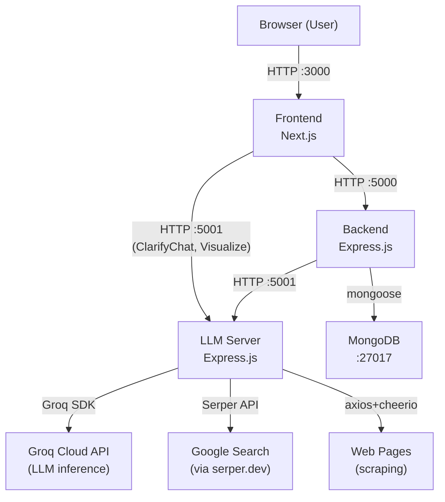
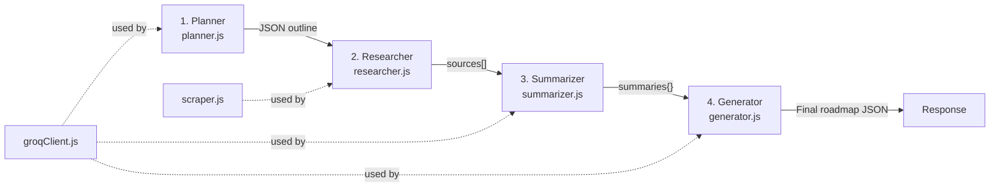
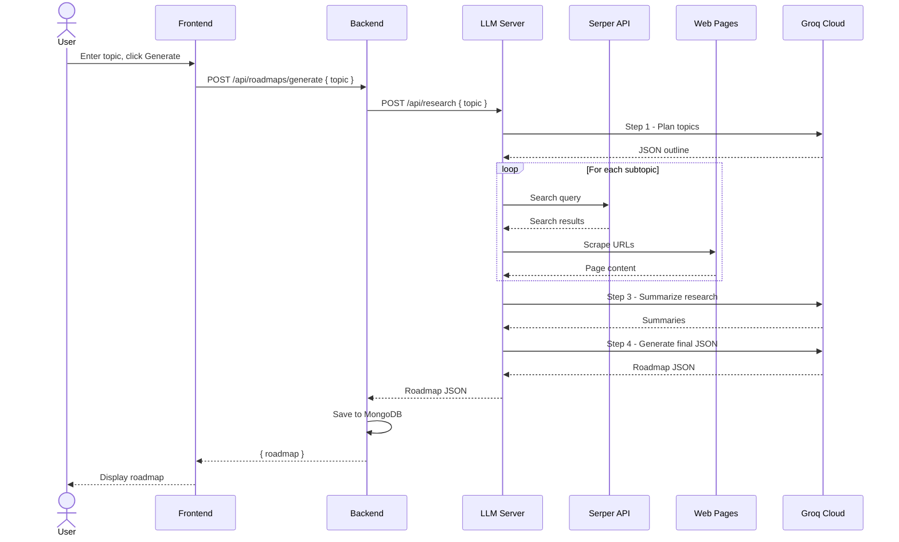
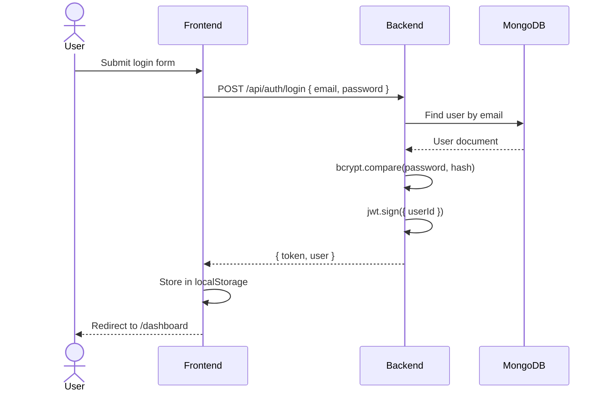

# SARAL — Full Project Walkthrough

> **SARAL** is an AI-powered learning platform that generates personalized roadmaps for any topic. It uses a deep research agent (LLM + web search + scraping) to produce structured learning paths with curated resources and quizzes.

## Architecture Overview



Three independent Node.js services running on different ports:

| Service | Port | Tech Stack | Purpose |
|---------|------|-----------|---------|
| **Frontend** | 3000 | Next.js 16, React 19, Vanilla CSS | UI — pages, components, auth context |
| **Backend** | 5000 | Express 5, Mongoose 9, JWT | REST API — auth, CRUD, proxies LLM calls |
| **LLM** | 5001 | Express 4, Groq SDK, Cheerio, pdf-parse | AI agent — research pipeline, clarify, visualize |

---

## Directory Tree

```
m-proj/
├── backend/                    # REST API server
│   ├── .env                    # MONGO_URI, JWT_SECRET, PORT
│   ├── package.json            # Dependencies: express, mongoose, bcryptjs, jwt, axios, multer
│   └── src/
│       ├── server.js           # Express app setup, routes, cors, listen
│       ├── config/
│       │   └── db.js           # MongoDB connection via mongoose
│       ├── middleware/
│       │   └── authMiddleware.js  # JWT verification middleware
│       ├── models/
│       │   ├── User.js         # User schema (email, password, username, age) + bcrypt hooks
│       │   └── Roadmap.js      # Roadmap schema (topics → subtopics → resources + questions)
│       ├── routes/
│       │   ├── authRoutes.js   # POST signup/login, GET/PATCH profile, PATCH change-password
│       │   └── roadmapRoutes.js # CRUD + generate + generate-from-roadmapsh + generate-from-pdf + upload JSON + toggle-complete + generate-questions
│       └── data/
│           └── mockData.js     # Fallback demo roadmap and generic quiz questions
│
├── frontend/                   # Next.js UI
│   ├── package.json            # Dependencies: next 16, react 19
│   ├── next.config.mjs         # Next.js configuration
│   ├── public/                 # Static assets (SVG icons)
│   └── src/
│       ├── app/
│       │   ├── layout.js       # Root layout: <AuthProvider> + <Navbar> + Inter font
│       │   ├── globals.css     # All styling (43 KB, vanilla CSS design system)
│       │   ├── page.js         # Landing page (hero + 3 feature cards)
│       │   ├── login/page.js   # Login form → AuthContext.login()
│       │   ├── signup/page.js  # Signup form → AuthContext.signup()
│       │   ├── profile/page.js # Edit profile (username, email, age, change password)
│       │   └── dashboard/
│       │       ├── page.js     # Dashboard overview (stats cards + quick actions + about)
│       │       ├── paths/page.js       # Learning paths list + generate + upload JSON + upload PDF
│       │       ├── completed/page.js   # Completed roadmaps filter view
│       │       └── roadmap/[id]/page.js # Single roadmap detail (accordion topics, resources, quiz, clarify chat, visualize)
│       ├── components/
│       │   ├── Navbar.js               # Top nav (brand, links, auth-aware)
│       │   ├── RoadmapCard.js          # Roadmap summary card with progress bar
│       │   ├── Accordion.js            # Collapsible section (used for topics/subtopics)
│       │   ├── QuizCard.js             # MCQ question with instant feedback
│       │   ├── ClarifyChat.js          # In-context AI Q&A chat (calls LLM /api/clarify)
│       │   └── VisualizationModal.js   # Full-screen iframe for LLM-generated HTML visualizations
│       └── context/
│           └── AuthContext.js  # React context: user state, login/signup/logout, authFetch helper
│
└── llm/                        # AI Research Agent server
    ├── .env                    # Groq API keys (3), model name, Serper key, token limits
    ├── .gitignore
    ├── package.json            # Dependencies: groq-sdk, axios, cheerio, express, multer, pdf-parse
    ├── output/                 # (Generated output files)
    └── src/
        ├── index.js            # Express server: 5 API endpoints (see below)
        ├── groqClient.js       # Groq SDK wrapper: round-robin multi-key, retry, strip think tags
        ├── planner.js          # Step 1: LLM generates topic/subtopic outline from a text topic
        ├── researcher.js       # Step 2: Searches Serper (Google) for each subtopic, scrapes results
        ├── scraper.js          # Web scraper: axios + cheerio, strips nav/ads, extracts main content
        ├── summarizer.js       # Step 3: LLM summarizes scraped research per topic
        ├── generator.js        # Step 4: LLM generates final roadmap JSON (resources + quizzes)
        ├── roadmapSh.js        # Alt pipeline: single LLM call to generate roadmap based on roadmap.sh knowledge
        └── pdfRoadmapGenerator.js # PDF pipeline: extract PDF text → plan → research → summarize → generate
```

---

## Backend — Detailed Breakdown

### Environment ([.env](file:///home/kamalnath.velpula/Desktop/m-proj/backend/.env))
```env
MONGO_URI=mongodb://localhost:27017/learningpath_db
JWT_SECRET=<hex-string>
PORT=5000
```

### Entry Point: [server.js](file:///home/kamalnath.velpula/Desktop/m-proj/backend/src/server.js)
- Creates Express app with CORS and JSON body parser
- Mounts two route groups: `/api/auth` and `/api/roadmaps`
- Connects to MongoDB, then starts listening on port 5000

### Database: [db.js](file:///home/kamalnath.velpula/Desktop/m-proj/backend/src/config/db.js)
- `connectDB()` — connects to MongoDB using `process.env.MONGO_URI`
- Exits process on failure

### Auth Middleware: [authMiddleware.js](file:///home/kamalnath.velpula/Desktop/m-proj/backend/src/middleware/authMiddleware.js)
- Extracts JWT from `Authorization: Bearer <token>` header
- Verifies with `process.env.JWT_SECRET`
- Attaches `req.userId` for downstream handlers

### Models

#### [User.js](file:///home/kamalnath.velpula/Desktop/m-proj/backend/src/models/User.js)
| Field | Type | Notes |
|-------|------|-------|
| `username` | String | Optional, trimmed |
| `email` | String | Required, unique, lowercase |
| `password` | String | Required, min 6 chars, auto-hashed via bcrypt `pre('save')` |
| `age` | Number | Optional |
| `timestamps` | Auto | `createdAt`, `updatedAt` |

Methods: `comparePassword(candidate)` — bcrypt comparison

#### [Roadmap.js](file:///home/kamalnath.velpula/Desktop/m-proj/backend/src/models/Roadmap.js)
Nested schema structure:
```
Roadmap
  ├── userId (ObjectId → User)
  ├── title, description
  ├── timestamps
  └── topics[]
       ├── title, description
       └── subtopics[]
            ├── title, description
            ├── completed (Boolean, default false)
            ├── resources[] → { title, url, type }
            └── questions[] → { question, options[], correctAnswer }
```

### Routes

#### [authRoutes.js](file:///home/kamalnath.velpula/Desktop/m-proj/backend/src/routes/authRoutes.js) — `/api/auth`

| Method | Endpoint | Auth? | Description |
|--------|----------|-------|-------------|
| POST | `/signup` | No | Create user, return JWT |
| POST | `/login` | No | Validate credentials, return JWT |
| GET | `/profile` | Yes | Return user profile (without password) |
| PATCH | `/profile` | Yes | Update username, email, age |
| PATCH | `/change-password` | Yes | Verify old password, set new one |

#### [roadmapRoutes.js](file:///home/kamalnath.velpula/Desktop/m-proj/backend/src/routes/roadmapRoutes.js) — `/api/roadmaps`

All routes require auth (`router.use(authMiddleware)`).

| Method | Endpoint | Description |
|--------|----------|-------------|
| GET | `/` | List all user's roadmaps |
| GET | `/:id` | Get single roadmap with full nested data |
| DELETE | `/:id` | Delete a roadmap |
| POST | `/generate` | Proxy to LLM `/api/research` — full 4-step pipeline |
| POST | `/generate-from-roadmapsh` | Proxy to LLM `/api/roadmap-sh` — single-call roadmap.sh mode |
| POST | `/generate-from-pdf` | Upload PDF → proxy to LLM `/api/roadmap-pdf` |
| POST | `/upload` | Import roadmap from raw JSON body |
| POST | `/:id/topics/:ti/subtopics/:si/generate-questions` | Add demo quiz questions to a subtopic |
| PATCH | `/:id/topics/:ti/subtopics/:si/toggle-complete` | Toggle subtopic completion |

### Mock Data: [mockData.js](file:///home/kamalnath.velpula/Desktop/m-proj/backend/src/data/mockData.js)
- `getDemoRoadmap(userId)` — hardcoded "Backend Developer Path" roadmap
- `getDemoQuestions(subtopicTitle)` — 3 generic MCQ questions used as fallback

---

## Frontend — Detailed Breakdown

### Tech Stack
- **Next.js 16** with App Router (file-based routing under `src/app/`)
- **React 19** with hooks (`useState`, `useEffect`, `useContext`, `useMemo`)
- **Vanilla CSS** — all styles in one monolithic [globals.css](file:///home/kamalnath.velpula/Desktop/m-proj/frontend/src/app/globals.css) (43 KB)
- **No external component libraries** — all components hand-written

### Layout & Context

#### [layout.js](file:///home/kamalnath.velpula/Desktop/m-proj/frontend/src/app/layout.js)
- Wraps everything in `<AuthProvider>` + `<Navbar>`
- Loads Inter font from Google Fonts
- Sets metadata: title "SARAL"

#### [AuthContext.js](file:///home/kamalnath.velpula/Desktop/m-proj/frontend/src/context/AuthContext.js)
Provides to all components via `useAuth()`:
| Function | Description |
|----------|-------------|
| `signup(username, email, password, age)` | POST to `/api/auth/signup`, stores token in localStorage |
| `login(email, password)` | POST to `/api/auth/login`, stores token |
| `logout()` | Clears localStorage, redirects to `/login` |
| `updateUser(updatedUser)` | Updates React state + localStorage |
| `authFetch(url, options)` | Fetch with auto-injected `Authorization` header (JSON) |
| `authFetchFormData(url, options)` | Fetch for file uploads (no Content-Type header so browser sets boundary) |

State: `user`, `token`, `loading`

### Pages

| Route | File | Description |
|-------|------|-------------|
| `/` | [page.js](file:///home/kamalnath.velpula/Desktop/m-proj/frontend/src/app/page.js) | Landing page — hero section + 3 feature cards |
| `/login` | [page.js](file:///home/kamalnath.velpula/Desktop/m-proj/frontend/src/app/login/page.js) | Email/password login form |
| `/signup` | [page.js](file:///home/kamalnath.velpula/Desktop/m-proj/frontend/src/app/signup/page.js) | Registration form (username, email, password, age) |
| `/profile` | [page.js](file:///home/kamalnath.velpula/Desktop/m-proj/frontend/src/app/profile/page.js) | Edit profile + change password |
| `/dashboard` | [page.js](file:///home/kamalnath.velpula/Desktop/m-proj/frontend/src/app/dashboard/page.js) | Overview: stats (total/active/completed), quick actions, about section |
| `/dashboard/paths` | [page.js](file:///home/kamalnath.velpula/Desktop/m-proj/frontend/src/app/dashboard/paths/page.js) | **Main page** — list roadmaps, generate new (topic input), upload JSON, upload PDF |
| `/dashboard/completed` | [page.js](file:///home/kamalnath.velpula/Desktop/m-proj/frontend/src/app/dashboard/completed/page.js) | Filter view: only fully completed roadmaps |
| `/dashboard/roadmap/[id]` | [page.js](file:///home/kamalnath.velpula/Desktop/m-proj/frontend/src/app/dashboard/roadmap/%5Bid%5D/page.js) | **Detail page** — accordion topics/subtopics, resources, quizzes, AI chat, visualization |

### Components

| Component | File | Purpose |
|-----------|------|---------|
| `Navbar` | [Navbar.js](file:///home/kamalnath.velpula/Desktop/m-proj/frontend/src/components/Navbar.js) | Top navigation — brand, dashboard/paths/profile links (auth-aware), logout |
| `RoadmapCard` | [RoadmapCard.js](file:///home/kamalnath.velpula/Desktop/m-proj/frontend/src/components/RoadmapCard.js) | Card showing roadmap title, description, progress bar, topic count, date, delete button |
| `Accordion` | [Accordion.js](file:///home/kamalnath.velpula/Desktop/m-proj/frontend/src/components/Accordion.js) | Collapsible section with chevron, completion check mark, badge |
| `QuizCard` | [QuizCard.js](file:///home/kamalnath.velpula/Desktop/m-proj/frontend/src/components/QuizCard.js) | Single MCQ — click option → instant correct/incorrect feedback |
| `ClarifyChat` | [ClarifyChat.js](file:///home/kamalnath.velpula/Desktop/m-proj/frontend/src/components/ClarifyChat.js) | Chat box for asking AI questions about a subtopic (calls LLM `/api/clarify` directly) |
| `VisualizationModal` | [VisualizationModal.js](file:///home/kamalnath.velpula/Desktop/m-proj/frontend/src/components/VisualizationModal.js) | Full-screen modal with sandboxed iframe rendering LLM-generated interactive HTML |

---

## LLM Server — Detailed Breakdown

### Environment ([.env](file:///home/kamalnath.velpula/Desktop/m-proj/llm/.env))
```env
# Groq API Keys (round-robin load distribution)
GROQ_API_KEY_1=<key>
GROQ_API_KEY_2=<key>
GROQ_API_KEY_3=<key>
GROQ_MODEL=openai/gpt-oss-120b         # Configurable model

# Web search
SERPER_API_KEY=<key>                    # Serper.dev Google search API

# Token limits (per-request max_tokens for different endpoints)
MAX_SOURCES_PER_SUBTOPIC=2
MAX_TOKENS_RESEARCH=65536
MAX_TOKENS_VISUALIZE=65536
MAX_TOKENS_CLARIFY=65536
MAX_TOKENS_PDF=16384                    # For PDF outline generation
```

### Entry Point: [index.js](file:///home/kamalnath.velpula/Desktop/m-proj/llm/src/index.js)

5 API endpoints:

| Method | Endpoint | Description | Pipeline |
|--------|----------|-------------|----------|
| GET | `/api/health` | Health check | Returns `{ status, model }` |
| POST | `/api/research` | **Main pipeline** — full 4-step research | Plan → Research → Summarize → Generate |
| POST | `/api/roadmap-sh` | Single-call roadmap.sh mode | roadmapSh.js |
| POST | `/api/roadmap-pdf` | PDF upload → full pipeline | pdfRoadmapGenerator.js |
| POST | `/api/clarify` | Answer questions about a subtopic | Single LLM call with context |
| POST | `/api/visualize` | Generate interactive HTML visualization | Single LLM call → returns `{ html }` |

### Core Pipeline (4 Steps)



#### Step 1 — [planner.js](file:///home/kamalnath.velpula/Desktop/m-proj/llm/src/planner.js)
- `planTopics(topic)` — asks LLM to create a structured outline (topics + subtopics) from a text topic
- Returns JSON: `{ title, description, topics: [{ title, description, subtopics: [...] }] }`

#### Step 2 — [researcher.js](file:///home/kamalnath.velpula/Desktop/m-proj/llm/src/researcher.js)
- `researchSubtopics(plan)` — for each subtopic:
  - Searches Google via Serper API (`searchSerper`)
  - Scrapes each result URL via `scraper.js`
  - Returns array of `{ topicTitle, subtopicTitle, sources: [{ title, url, snippet, content }] }`

#### Scraper — [scraper.js](file:///home/kamalnath.velpula/Desktop/m-proj/llm/src/scraper.js)
- `scrapePage(url)` — fetches HTML, strips nav/footer/ads via blocked selectors, extracts main content using Cheerio
- Truncates to 6000 chars, rejects pages with < 100 chars

#### Step 3 — [summarizer.js](file:///home/kamalnath.velpula/Desktop/m-proj/llm/src/summarizer.js)
- `summarizeAllTopics(plan, researchData)` — for each topic, sends scraped content to LLM
- Returns per-topic: `{ topicDescription, subtopics: [{ title, description, keyConcepts, resourceTypes }] }`

#### Step 4 — [generator.js](file:///home/kamalnath.velpula/Desktop/m-proj/llm/src/generator.js)
- `generateRoadmapJSON(plan, researchData, topicSummaries)` — generates the final roadmap with:
  - Detailed descriptions from summaries
  - Real URLs from research
  - Quiz questions per subtopic
- Has `repairJSON()` function to fix truncated LLM responses
- Retries up to 2 times on failure

#### [groqClient.js](file:///home/kamalnath.velpula/Desktop/m-proj/llm/src/groqClient.js) — LLM Client
- **Multi-key round-robin**: supports up to 3 Groq API keys for load distribution
- **Retry logic**: retries on 429 (rate limit) and 413 (token limit) with exponential backoff
- **`stripThinkTags()`**: removes `<think>...</think>` tags from reasoning model output
- **Configurable model** via `GROQ_MODEL` env var

#### Alt Pipelines

**[roadmapSh.js](file:///home/kamalnath.velpula/Desktop/m-proj/llm/src/roadmapSh.js)** — Single LLM call that generates a roadmap based on the LLM's knowledge of roadmap.sh content for a given topic. No web search or scraping.

**[pdfRoadmapGenerator.js](file:///home/kamalnath.velpula/Desktop/m-proj/llm/src/pdfRoadmapGenerator.js)** — PDF-to-roadmap:
1. Extract text from PDF buffer using `pdf-parse`
2. Plan topics from PDF content (LLM, max tokens from `MAX_TOKENS_PDF`)
3. Research subtopics via web search (same as main pipeline Step 2)
4. Summarize + generate (same Steps 3–4)

---

## Data Flow Diagrams

### Generate Roadmap (Main Flow)


### Auth Flow


---

## How to Run

```bash
# Prerequisites: Node.js 20+, MongoDB running on localhost:27017

# Terminal 1 — Backend
cd backend
npm install
npm start          # Runs on :5000

# Terminal 2 — Frontend
cd frontend
npm install
npm start          # Runs on :3000

# Terminal 3 — LLM Server
cd llm
npm install
npm start          # Runs on :5001 (with --watch for auto-reload)
```

### Required Environment Variables

| Service | Variable | Purpose |
|---------|----------|---------|
| Backend | `MONGO_URI` | MongoDB connection string |
| Backend | `JWT_SECRET` | Secret for JWT signing |
| LLM | `GROQ_API_KEY_1/2/3` | Groq Cloud API keys (at least 1 required) |
| LLM | `GROQ_MODEL` | LLM model to use (default: `llama-3.3-70b-versatile`) |
| LLM | `SERPER_API_KEY` | Google search via serper.dev |

---

## Key Design Decisions

1. **Three separate services** — Frontend, Backend, LLM are decoupled. Backend proxies LLM calls so auth can be enforced. ClarifyChat and VisualizationModal call LLM directly (no auth needed for read-only AI features).

2. **Round-robin API keys** — The LLM client cycles through up to 3 Groq API keys to avoid rate limiting during heavy research pipelines.

3. **All CSS in one file** — `globals.css` (43 KB) contains the entire design system rather than CSS modules/Tailwind, keeping things simple.

4. **JSON repair** — Both `generator.js` and `pdfRoadmapGenerator.js` have JSON repair logic to handle truncated LLM responses (closes unclosed brackets/braces).

5. **Three roadmap generation modes**:
   - **Research mode** (`/api/research`) — Full pipeline with web search + scraping
   - **Roadmap.sh mode** (`/api/roadmap-sh`) — Single LLM call, no web search
   - **PDF mode** (`/api/roadmap-pdf`) — Extract PDF → same research pipeline
